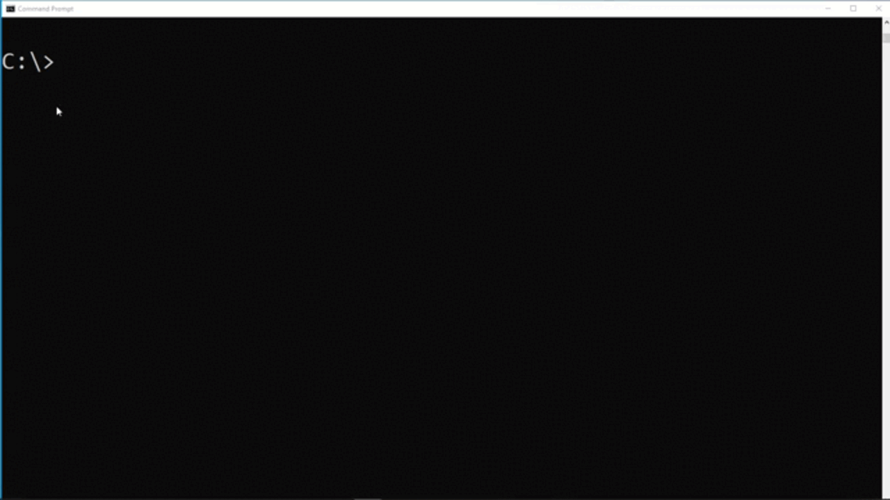

# CONSOLE at PHP 🔥

## DESCRIPTION OF PROJECT

- This application it's about an challenge where i had to generator a cross and an x at console with php.

### PRIMEIRO CÓDIGO E RESULTADO:

```
...*...
.*****.
...*...
...*...
...*...

```

```
*...*
.*.*.
..*..
.*.*.
*...*

```

# SEGUNDO CÓDIGO:

## COMO VISUALIZAR O PROJETO:

Para visualizar o projeto: 

Escolha uma interface de linha de comando de sua preferência e visualize o resultado diretamente por ela.

Saída no console: 


### EXPLICAÇÃO

No segundo código, abordei o conceito de Programação Orientada a Objetos com PHP e utilizei índices para adicionar asteriscos e formar os desenhos de "X" e "CRUZ".


